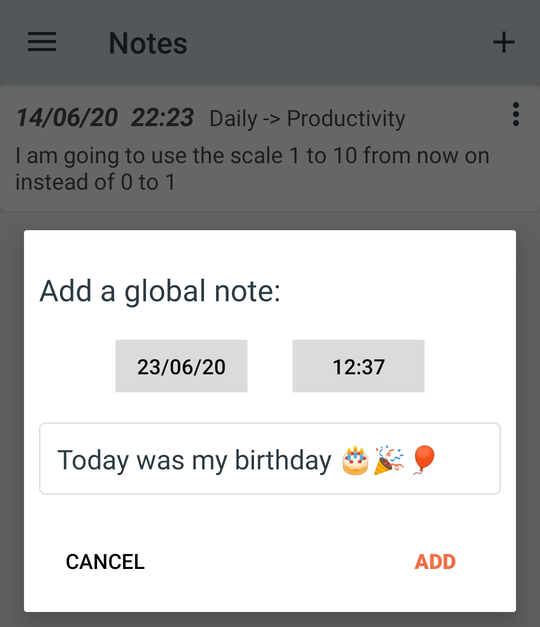

# How do notes work?

Notes allow you to keep track of qualitative data alongside your quantitative data. There are two types of notes:\n\n• Global notes (added directly in the notes menu)\n\n• Data point notes (attached to specific data points)\n\nWhen adding a data point you may wish to track an important piece of information specific to that data set. For example:

After adding this note you will notice it shows up in a list underneath any graph of that data set. If you tap the note it will open in a dialog window and a marker will be added to the graph.

However some pieces of information might be relevant to all your data. In this case you can add a global note by tapping the plus button in the global notes menu:

You will notice this note now shows up underneath all graphs.

You can edit or delete any note from the notes menu. Deleting a data point note from the notes menu will not delete the data point its self, just the attached note.
